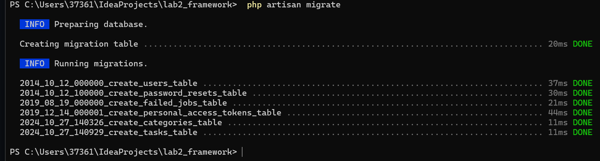
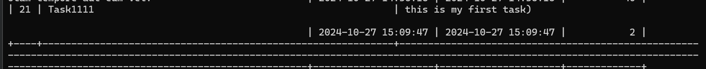

# Лабораторная работа №3. Основы работы с базами данных в Laravel

## Цель работы

Познакомиться с основными принципами работы с базами данных в Laravel. Научиться создавать миграции, модели и сиды на
основе веб-приложения `To-Do App`.

## Условие

В данной лабораторной работе вы продолжите разработку приложения `To-Do App` для команд, начатого в предыдущих
лабораторных работах.

Вы добавите функциональность работы с базой данных, создадите модели и миграции, настроите связи между моделями и
научитесь использовать фабрики и сиды для генерации тестовых данных.

### №1. Подготовка к работе

> [!TIP]
> Темы: S3

1. Установите СУБД MySQL, PostgreSQL или SQLite на вашем компьютере.
2. Создание базы данных: Создайте новую базу данных для вашего приложения **todo_app**.
3. Настройте переменные окружения в файле `.env` для подключения к базе данных:
   ```env
   DB_CONNECTION=ваша_бд (mysql, pgsql, sqlite)
   DB_HOST=127.0.0.1
   DB_PORT=3306
   DB_DATABASE=todo_app
   DB_USERNAME=ваш_пользователь
   DB_PASSWORD=ваш_пароль
   ```
   

### №2. Создание моделей и миграций

> [!TIP]
> Темы: S6, S7

1. Создайте модель `Category` — категория задачи.
    - `php artisan make:model Category -m`
2. Определение структуры таблицы **category** в миграции:
    - Добавьте поля:
        - `id` — первичный ключ;
        - `name` — название категории;
        - `description` — описание категории;
        - `created_at` — дата создания категории;
        - `updated_at` — дата обновления категории.
          
3. Создайте модель `Task` — задача.
4. Определение структуры таблицы **task** в миграции:
    - Добавьте поля:
        - `id` — первичный ключ;
        - `title` — название задачи;
        - `description` — описание задачи;
        - `created_at` — дата создания задачи;
        - `updated_at` — дата обновления задачи.
5. Запустите миграцию для создания таблицы в базе данных:
   ```bash
   php artisan migrate
   ```



6. Создайте модель `Tag` — тег задачи.
7. Определение структуры таблицы **tag** в миграции:
    - Добавьте поля:
        - `id` — первичный ключ;
        - `name` — название тега;
        - `created_at` — дата создания тега;
        - `updated_at` — дата обновления тега.
8. Добавьте поле `$fillable` в модели `Task`, `Category` и `Tag` для массового заполнения данных.

### №3. Связь между таблицами

> [!TIP]
> Темы: S8

1. Создайте миграцию для добавления поля `category_id` в таблицу **task**.
    - `php artisan make:migration add_category_id_to_tasks_table --table=tasks`
    - Определите структуру поля `category_id` и добавьте внешний ключ для связи с таблицей **category**.
2. Создайте промежуточную таблицу для связи многие ко многим между задачами и тегами:
    - `php artisan make:migration create_task_tag_table`
3. Определение соответствующей структуры таблицы в миграции.
    - Данная таблица должна связывать задачи и теги по их идентификаторам.
    - **Например**: `task_id` и `tag_id`: `10` задача связана с `5` тегом.
4. Запустите миграцию для создания таблицы в базе данных.
   

### №4. Связи между моделями

> [!TIP]
> Темы: S8

1. Добавьте отношения в модель `Category` (Категория может иметь много задач)
    - Откройте модель `Category` и добавьте метод:
      ```php
      public function tasks()
      {
          return $this->hasMany(Task::class);
      }
      ```
2. Добавьте отношения в модель `Task`
    - Задача прикреплена к одной категории.
    - Задача может иметь много тегов.
3. Добавьте отношения в модель `Tag` (Тег может быть прикреплен к многим задачам)
4. Добавьте соотвтествующие поля в `$fillable` моделей.

### №5. Создание фабрик и сидов

> [!TIP]
> Темы: S7, S8

1. Создайте фабрику для модели `Category`:
    - `php artisan make:factory CategoryFactory --model=Category`
    - Определите структуру данных для генерации категорий.
2. Создайте фабрику для модели `Task`.
3. Создайте фабрику для модели `Tag`.
   
4. Создайте сиды (`seeders`) для заполнения таблиц начальными данными для моделей: `Category`, `Task`, `Tag`.
5. Обновите файл `DatabaseSeeder` для запуска сидов и запустите их:
   ```bash
   php artisan db:seed
   ```
   

### №6. Работа с контроллерами и представлениями

> [!TIP]
> Темы: S4, S5, S7, S8

1. Откройте контроллер `TaskController` (`app/Http/Controllers/TaskController.php`).
2. Обновите метод `index` для получения списка задач из базы данных.
    - Используйте модель `Task` для получения всех задач.
3. Обновите метод `show` для отображения отдельной задачи.
    - Отобразите информацию о задаче по ее идентификатору
    - **Обязательно** отобразите категорию и теги задачи.
4. В методах `index` и `show` используйте метод `with` (**Eager Loading**) для загрузки связанных моделей.
4. Обновите соответствующие представления для отображения списка задач и отдельной задачи.
5. Обновите метод `create` для отображения формы создания задачи и метод `store` для сохранения новой задачи в базе
   данных.
    - **Примечание**: Поскольку вы ещё не изучали работу с формами, используйте объект `Request` для получения данных. *
      *Например**:
      ```php
      $request->input('title');
      // или
      $request->all();
      ```
6. Обновите метод `edit` для отображения формы редактирования задачи и метод `update` для сохранения изменений в базе
   данных.
7. Обновите метод `destroy` для удаления задачи из базы данных.4
   
   
   
   
   
   
   
   

## Дополниетльные задания

> [!NOTE]
> **Важно**: Данные задания не являются обязательными, но помогут углубить понимание материала.

1. Создайте модель `Comment` для комментариев к задачам.
    - Добавьте соответствующие поля в миграции.
    - Создайте отношения между моделями Task и Comment.
2. Добавьте возможность добавления комментариев к задачам.
    - Обновите представление для отображения комментариев к задаче и возможность просмотра списка комментариев и
      комментария по `id`: `/task/{id}/comment`, `/task/{id}/comment/{comment_id}`
3. Добавьте возможность добавления тегов к задачам и используйте транзакции для сохранения связей между задачами и
   тегами.
   ```php
   DB::transaction(function () use ($request) {
        // Создание задачи
        // Привязка тегов к задаче
    });
    ```

# Контрольные вопросы

## 1. Что такое миграции и для чего они используются?

Миграции в Laravel представляют собой способ управления изменениями в структуре базы данных. Они позволяют
разработчикам:

- **Создавать** и **изменять** таблицы и их поля с помощью PHP-кода.
- **Версионировать** изменения, что позволяет легко возвращаться к предыдущим версиям структуры базы данных.
- **Синхронизировать** изменения в базе данных между разными окружениями (например, локальным, тестовым и продакшен).
- Упрощать процесс работы с базами данных, исключая необходимость написания сложных SQL-запросов.

## 2. Что такое фабрики и сиды, и как они упрощают процесс разработки и тестирования?

**Фабрики** и **сиды** в Laravel используются для автоматической генерации тестовых данных.

- **Фабрики** позволяют создавать модели с фейковыми данными. Это особенно полезно для тестирования, так как помогает
  разработчикам быстро заполнять базу данных необходимыми данными без ручного ввода.
- **Сиды** (или сидеры) используются для заполнения базы данных начальными данными. Они позволяют удобно и быстро
  добавлять записи в таблицы, например, при установке приложения или тестировании.

Вместе фабрики и сиды:

- Упрощают процесс разработки, позволяя разработчикам сосредоточиться на функциональности приложения, а не на данных.
- Способствуют более качественному тестированию, так как позволяют легко генерировать множество тестовых случаев.

## 3. Что такое ORM? В чем различия между паттернами `DataMapper` и `ActiveRecord`?

**ORM** (Object-Relational Mapping) — это метод, который позволяет разработчикам взаимодействовать с базой данных,
используя объекты вместо прямых SQL-запросов. ORM упрощает работу с базами данных, преобразуя строки таблиц в объекты и
наоборот.

### Различия между `DataMapper` и `ActiveRecord`:

- **ActiveRecord**:
    - Каждая модель содержит логику для работы с соответствующей таблицей в базе данных.
    - Прямое связывание между объектами и строками таблиц.
    - Пример: В Laravel модель автоматически управляет данными, связанными с конкретной таблицей.

- **DataMapper**:
    - Разделяет логику работы с данными и бизнес-логику. Объекты не знают, как сохранять или загружать свои данные.
    - Логика работы с данными находится в отдельных классах, которые управляют взаимодействием между объектами и базой
      данных.
    - Это позволяет лучше отделить бизнес-логику от доступа к данным.

## 4. В чем преимущества использования ORM по сравнению с прямыми SQL-запросами?

- **Упрощение кода**: ORM позволяет писать меньше кода для выполнения операций с базой данных, так как преобразует
  объекты в запросы автоматически.
- **Безопасность**: ORM защищает от SQL-инъекций, используя параметры вместо прямого включения данных в запросы.
- **Упрощенная миграция**: Изменение структуры базы данных осуществляется с помощью миграций, а не вручную через SQL.
- **Кроссплатформенность**: ORM позволяет использовать различные базы данных без изменения кода приложения.
- **Улучшенная поддержка и тестирование**: Использование объектов вместо строк делает тестирование более простым и
  эффективным.

## 5. Что такое транзакции и зачем они нужны при работе с базами данных?

**Транзакции** — это группы операций, которые должны быть выполнены вместе. Если одна из операций не может быть
выполнена, все изменения, сделанные в рамках транзакции, отменяются.

### Зачем нужны транзакции?

- **Целостность данных**: Транзакции гарантируют, что данные будут в согласованном состоянии. Если какая-то часть
  операции не удалась, изменения отменяются.
- **Избежание неполных операций**: Например, при переводе денег между счетами необходимо, чтобы средства были списаны с
  одного счета и добавлены на другой. Если одна из операций не удалась, транзакция гарантирует, что обе операции будут
  отменены.
- **Согласованность**: Транзакции помогают поддерживать согласованность данных, особенно в многопользовательских
  системах, где разные пользователи могут одновременно пытаться изменить одни и те же данные.
