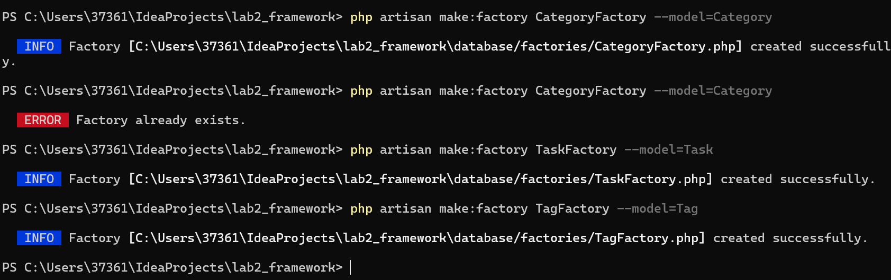
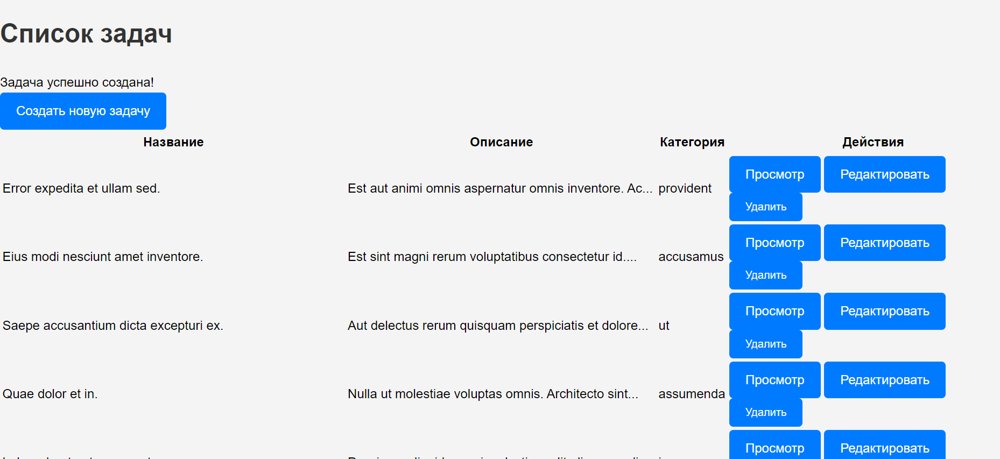
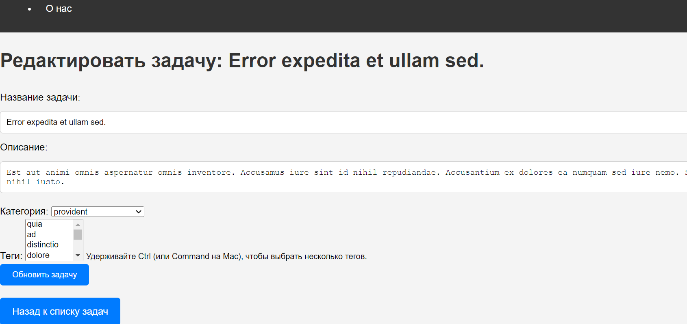

# Лабораторная работа №2. HTTP-запросы и шаблонизация в Laravel

## Цель работы

Изучить основные принципы работы с HTTP-запросами в Laravel и шаблонизацию с использованием Blade на основе
веб-приложения **To-Do App для команд** — приложения для управления задачами внутри команды.

## Описание приложения

Приложение предназначено для команды, которая хочет управлять своими задачами, назначать их участникам, отслеживать
статус и приоритет задач (похоже на Github Issues).

## Условия выполнения

### №1. Подготовка к работе, установка Laravel

1. Создать новый проект Laravel с именем `todo-app`.
2. Перейти в директорию проекта и запустить встроенный сервер Laravel.
3. Проверить работу приложения в браузере по адресу [http://localhost:8000](http://localhost:8000).

### №2. Настройка окружения

1. Открыть файл `.env` и настроить параметры приложения:
    - `APP_NAME=ToDoApp`
    - `APP_ENV=local`
    - `APP_KEY=`
    - `APP_DEBUG=true`
    - `APP_URL=http://localhost:8000`
2. Сгенерировать ключ приложения.

### №3. Основы работы с HTTP-запросами

#### №3.1. Создание маршрутов для главной страницы и страницы "О нас"

1. Создать класс-контроллер `HomeController` для обработки запросов на главную страницу.
   
2. Добавить метод `index` в `HomeController`.
   
3. Создать маршрут для главной страницы и проверить его работу в браузере.
   
   
4. Создать метод и маршрут для страницы "О нас".
5. Добавьте маршрут для страницы "О нас" в файле routes/web.php. .
   

#### №3.2. Создание маршрутов для задач

1. Создать класс-контроллер `TaskController` с методами для обработки задач:
    - `index`, `create`, `store`, `show`, `edit`, `update`, `destroy`.
2. Определить маршруты для методов контроллера с использованием группирования и префикса `/tasks`.
3. Добавить валидацию параметров маршрута `id`.
4. Заменить ручное создание маршрутов на ресурсный контроллер.

**Вопрос**: Объяснить разницу между ручным созданием маршрутов и использованием ресурсного контроллера.

## Ручное создание маршрутов требует явного определения каждого маршрута и метода контроллера, что может привести к дублированию кода, тогда как использование ресурсного контроллера автоматически генерирует маршруты для всех стандартных CRUD операций, упрощая структуру, повышая читаемость кода и снижая вероятность ошибок.

7. Проверьте созданные маршруты с помощью команды php artisan route:list.
   вручную:
   
   автоматически:
   
   я заменила код чтобы было id
   

### №4. Шаблонизация с использованием Blade

#### №4.1. Создание макета страницы

1. Создать макет страницы `layouts/app.blade.php` с общими элементами.
   

#### №4.2. Использование шаблонов Blade

1. Создать представления для главной страницы и страницы "О нас":
    - `home.blade.php`
    - `about.blade.php`
2. Создать представления для задач:
    - `index.blade.php` — список задач;
    - `show.blade.php` — отображение задачи.
      
      
      

#### №4.3. Анонимные компоненты Blade

1. Создать анонимные компоненты для отображения элементов интерфейса:
    - `header` и `task`.
      

#### №4.4. Стилизация страниц

1. Создать файл стилей `app.css` и подключить его к макету.
   
   

### №5. Дополнительные задания

1. Использовать View Composer для отображения последней созданной задачи на главной странице.
2. Создать дополнительный анонимный компонент для отображения приоритета задачи с разными цветами или иконками.

## Контрольные вопросы

1. **Что такое ресурсный контроллер в Laravel и какие маршруты он создает?**  
   Ресурсный контроллер в Laravel позволяет автоматически генерировать маршруты для стандартных операций CRUD (создание,
   чтение, обновление, удаление) с помощью единственной команды, что упрощает управление маршрутами. Он создает маршруты
   для отображения списка ресурсов, создания нового ресурса, отображения конкретного ресурса, редактирования ресурса и
   удаления ресурса.

2. **Объясните разницу между ручным созданием маршрутов и использованием ресурсного контроллера.**  
   Ручное создание маршрутов требует явного определения каждого маршрута, что может привести к дублированию и усложнению
   кода, тогда как ресурсный контроллер автоматически генерирует маршруты для стандартных операций, улучшая читаемость и
   упрощая поддержку кода.

3. **Какие преимущества предоставляет использование анонимных компонентов Blade?**  
   Анонимные компоненты Blade позволяют создавать повторно используемые элементы интерфейса без необходимости явно
   определять их в классе, что упрощает структуру и уменьшает объем кода. Они также способствуют более чистой и понятной
   разметке, поскольку позволяют легче настраивать параметры и стили.

4. **Какие методы HTTP-запросов используются для выполнения операций CRUD?**  
   Для выполнения операций CRUD используются следующие методы HTTP-запросов: `GET` для чтения ресурсов, `POST` для
   создания новых ресурсов, `PUT` или `PATCH` для обновления существующих ресурсов и `DELETE` для удаления ресурсов.

